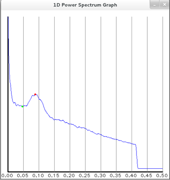
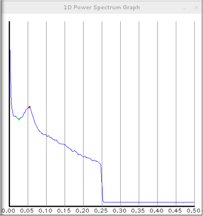
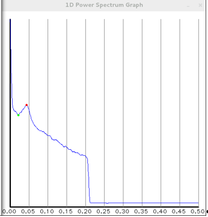

----------
## NFIR Overview

**NFIR** software development is ACTIVE to continue improvements in implementation.  However, the core resampling algorithms are complete and not expected to change.

The NIST Fingerprint Image Resampler **NFIR** is an algorithm that inputs a fingerprint image with some known sample rate (source) and generates a new image at a user-specified (target) sample rate.  Images may be upsampled or downsampled (hence "resampler" in its name).  To downsample without introducing high-frequency artifacts (spurious/incorrect pixel values) in the target image, the unwanted, higher frequency content in the source image is removed with a low pass filter (LPF), or mask.  The shape of the LPF-mask is elliptical to accommodate rectangular images.  By multiplying the mask with the image spectrum (frequency domain), all frequencies "inside" the elliptical mask area are retained while all "outside" are discarded.  Upsample requires no filtering.

This application is the replacement for NISTDownsampler `https://github.com/usnistgov/NISTDownsampler`.

The **NFIR** depends on the OpenCV library for image processing and Fourier transform support.  It was tested against versions 2.4.x, 3.4.x, and 4.4.0.  It should continue to work with future versions of OpenCV.  See section "Third-Party Tools" below in this document for more info.

The **NFIR** algorithm is built into a software library (file).  This accommodates the user to write their own user interface, possibly a GUI.  As a courtesy, a binary wrapper has been provided in addition to the library.  Runtime configuration data for the provided binary are read from either a configuration file or typical command-line switches.  Images may be resampled individually or by contents of a directory.

<span class="redc">IMPORTANT:</span> image metadata is NOT updated in the target image file and therefore will not reflect the actual sample rate of the resampled image.  It is incumbent upon the user to maintain sample rate info.  The easiest way to maintain sample rate is in the image filename, eg, `img_001-600to500ppi.png`.  Future updates to **NFIR** will include image metadata modification for png, and possibly bmp, compression formats.

For the **NFIR** executable, runtime configuration parameters include:

* source (**src**) and target (**tgt**) sample rates, Pixels per Inch (PPI) only, no metric
* source and target image file (path) -OR- source and target image directories (source dir is globbed and target filenames are generated)
* image file compression format (by filename extension)
* resample interpolation (ie, resize up/down to generated target image)
* filter mask (downsample only)

Based on the source and target sample rates, the software performs the appropriate resampling.  This ratio of (target / source) sample rate is the **resize factor**.

Any source and target sample rate is accepted.  The initial release and subsequent revisions of this software was only tested on source images with the source and target sample rates in Table 1; it has since been proven to perform correctly using any sample rates (source image sample rate must be well-known).

Resampling | Src ppi             | Tgt ppi
-----------|---------------------|-----------
UP         | 300 and 400         | 500
DOWN       | 600, 1000, and 1200 | 500

**Table 1 - Tested sample rates**

<span class="redc">
Additionally, while <b>NFIR</b> utilizes image compression formats supported by OpenCV, <b>only images using PNG, JPG, and BMP compression have been tested.</b>
</span>

----------
## NFIR Core Algorithm
**NFIR** supports the most common source and target sample rates that are most likely encountered in the field.  By programmatically setting the default filter-mask and interpolation configurations per Tables 2 and 3, the user is "freed" from having to "guess" the best combination of parameters.

Also, source imagery should be 8-bit grayscale.  **NFIR** does not warn user if other than grayscale is input; it will attempt to resample regardless.

### Upsample
When the target sample rate is greater than the source, `Upsample` is implemented via the OpenCV library `resize()` function. Resize interpolation methods include `bilinear` and `bicubic`; selection is configurable by the user if the recommended bicubic interpolation is not desired.  Unlike downsampling, zero filtering of the source image occurs.

Src ppi | Tgt ppi | Resize interpolation
--------|---------|---------------------
300     | 500     | BICUBIC
400     | 500     | BICUBIC

**Table 2 - Recommended (and default) upsample interpolation methods**

### Downsample
When the target sample rate is less than the source, **NFIR** performs the `Downsample` procedure:

1.  Pad the source image with white pixels to the image right- and bottom-side borders; use the OpenCV `getOptimalDFTSize()` function to determine the pad counts
2.  Build the specified (Ideal or Gaussian) LPF (mask) based on the padded image size
3.  Invoke the discrete fourier transform (DFT) on padded image to generate the image-spectrum
4.  Multiply the image-spectrum by the "shifted" filter mask to generate the filtered spectrum
5.  Invoke the inverse fourier transform on the filtered spectrum (this generates a space-domain image)
6.  Crop the new image's white-pixel padding
7.  Reduce new image size by the resize factor; this becomes the downsampled image

Depending on the resize factor, the filter/mask shape and interpolation method are configured with default settings that
were experimentally determined, see Table 3 below.  However, it is possible to set the shape and method in the config file
or by command-line switches.

Src ppi | Tgt ppi | Filter-mask | Resize interpolation | Note |
--------|---------|-------------|----------------------|------|
600     | 500     | ideal       | BICUBIC              |  |
1000    | 500     | ideal       | BILINEAR             |  |
1200    | 500     | Gaussian    | BILINEAR             | Slightly better than BICUBIC |

**Table 3 - Recommended (and default) downsample configurations**

For any other source sample rate (ie, not in Table 2 or 3), it is recommended to specify interpolation-method and
downsample filter-mask and not to depend on default settings.  Best settings for your situation will most likely be
determined by "trial and error."

### Filtered Image Prior to Downsample
After the lowpass filter has been applied to the zero-padded source image, in the frequency domain, the image is
inverse-transformed and cropped by the zero-padding in preparation of the downsampling. Prior to downsampling, the image
has been captured and is available to the user, see source code comments for details.

The figures below are the SIVV 1D Power spectrums; the abscissa units is cycles/pixel.

Examples:
* 600 to 500ppi  (500/600)/2 = 0.416
* 1000 to 500  (500/1000)/2 = 0.25
* 1200 to 500  (500/1200)/2 = 0.208



**Figure 1 - Filtered prior to downsample, 600 to 500ppi**



**Figure 2 - Filtered prior to downsample, 1000 to 500ppi**



**Figure 3 - Filtered prior to downsample, 1200 to 500ppi**

----------
## NFIR Software

### Build Windows
Windows build utilizes the free, Microsoft, Visual Studio command line tools.  See file README_cmake_make.md for more details.

### Build Linux
GNU tools that support C++ 11 are used to compile/link.  See file README_cmake_make.md for more details.

```
$ make --version
GNU Make 3.82
Built for x86_64-redhat-linux-gnu
Copyright (C) 2010  Free Software Foundation, Inc.
License GPLv3+: GNU GPL version 3 or later <http://gnu.org/licenses/gpl.html>
This is free software: you are free to change and redistribute it.
There is NO WARRANTY, to the extent permitted by law.

$ g++ --version
g++ (GCC) 9.2.0
Copyright (C) 2019 Free Software Foundation, Inc.
This is free software; see the source for copying conditions.  There is NO
warranty; not even for MERCHANTABILITY or FITNESS FOR A PARTICULAR PURPOSE.
```

Note that earlier versions of `make` and `g++` will should work as well.

### How to Run
Runtime for windows and Linux are very similar.

Open a command prompt (terminal), change to the `bin` dir, and run:

```
.\NFIR\bin> NFIR_bin.exe -h
```

In the event of a runtime error due to "missing MSVCP140.dll," which is a Microsoft Visual C++ redistributable library, download from `https://www.microsoft.com/en-us/download/details.aspx?id=48145` and run the `.\MSVC_2015\vc_redist.x64.exe` to install it.  If there is still a problem, install the 32-bit version.

|NOTE|
|-|
|<span class="redc">This NFIR library "wrapper" (binary) processes images by either single-file or BY DIRECTORY.  All images under a source directory must have 1) the same sample rate, and 2) compression format reflected by image filename extension (bmp = bitmap image file, png = portable network graphics, etc.)</span>|

To ensure that the runtime configuration parameters are correct, use the `-y,--verify` command-line switch to print them to the console.  Answer the prompt to either continue or exit.

When source is a directory, the target filename is built by appending the resample "rate" info to the source filename, for example, `src_fname.png` -> `src_fname-600to500ppi.png`.

Verbose mode prints file path and current count to screen.  This is also useful in combination with `--dry-run`.

### Use Configuration File
All parameters may be configured via an initialization file.  To view the file's content, the source and target dirs must exist:
```
.\NFIR\bin> NFIR_bin.exe -pu ..\config\config.ini
```
otherwise:
```
.\NFIR\bin> NFIR_bin.exe -pu ..\config\config.ini
--src-dir: Directory does not exist: ..\..\images
Run with --help for more information.
```

Or, if performing single-file resampling, the source file must exist:

```
.\NFIR\bin> NFIR_bin.exe -pu ..\config\config_win.ini
--src-file: File does not exist: X:\source\A0002_E01_600PPI_02.png
Run with --help for more information.
```

### Resample Metadata
For each resample-run, **NFIR** captures source- and target-image metadata in an array of strings that is made
available to the using application.  These metadata include image container sizes and WxH of actual image.

### Capture a 'log'
For the included runtime binary, to capture the metadata to a file, set the boolean config parameters:
* `verbose=true`
* `verify=false`
* `dryrun=false`

and redirect the output to file, for example:

```
.\NFIR\bin> NFIR_bin.exe -u ..\config\config.ini > downsample1200to500.log
```

Note that the source- and target-image paths are not from the **NFIR** metadata.  To verify the paths prior to an actual
resample, set `dryrun=true`, for example:

```
.\NFIR\bin> NFIR_bin.exe -u ..\config\config.ini > downsample1200to500-dryrun.log
```

### Upsample
The only configurable parameter for upsampling is the interpolation method.  To force the interpolation method, either:

* set the *config.ini* file **interp-method** parameter to `bicubic` or `bilinear`
* use the `-i, --interp-method` command-line switch (overrides config file)

```
.\NFIR\bin> NFIR_bin.exe -a 395 -b 500 -s X:\images_src -t X:\images_tgt -m png -n png -i bilinear
.\NFIR\bin> NFIR_bin.exe -a 395 -b 500 -c X:\images_src\in.png -d X:\images_tgt\out_395to500.png -m png -n png -i bilinear
```

Otherwise, the interpolation method is set programmatically to `bicubic`.

### Downsample
Partial specification of config parameters uses "default" settings (see Table 3):

```
.\NFIR\bin> NFIR_bin.exe -a 600 -b 500 -s X:\images_src -t X:\images_tgt -m png -n png
.\NFIR\bin> NFIR_bin.exe -a 600 -b 500 -c X:\images_src\in.png -d X:\images_tgt\out_600to500.png -m png -n png
```

For verification and verbose display:

```
.\NFIR\bin> NFIR_bin.exe -a 600 -b 500 -s X:\images_src -t X:\images_tgt -m png -n png -y -z
```

If either filter shape or interpolation method are specified, then BOTH must be specified, or:

```
.\NFIR\bin> NFIR_bin.exe -a 600 -b 500 -s ..\..\images\src\600ppi -t ..\..\images\tgt\600to500ppi -m png -n png -f ideal
--downsamp-filter-shape requires --interp-method
Run with --help for more information.

.\NFIR\bin> NFIR_bin.exe -a 600 -b 500 -s ..\..\images\src\600ppi -t ..\..\images\tgt\600to500ppi -m png -n png -i bilinear
--interp-method requires --downsamp-filter-shape
Run with --help for more information.
```

### Runtime Batch Mode
When the source images are specified by directory/path, the target image filenames are generated using the source
filename as its base.  The current implementation to 'build' the target filename replaces the source PPI to resampled
PPI.  Note that the sample rate MUST be followed immediately by [PPI | ppi].  For example:

```
source: ABC_600PPI.png
target: ABC_0600to0500PPI.png
```

If the source filename does not contain sample-rate info, then this is the result:
```
source: ABC.png
target: 0600to0500PPIABC.png
```

## Third-Party Tools
### OpenCV
Used to support the NFIR algorithms.

Navigate to OpenCV download page and download the desired version for your windows or Linux platform.

For windows, run the downloaded executable and install to an appropriate dir.  For build of NFIR, see file README_build.md.

For Linux, click on the Sources link, download, and unzip to an appropriate dir.  Build the libraries.  For build of NFIR, `pkg-config` is used to point to the include and library directories; see file README_build.md.

### szx
Used by the binary wrapper only, glob the source file directory for list of source image files.

### CLI11
This stand-alone header file is used by the binary wrapper to support the command-line interface input parameters.  See `https://github.com/CLIUtils/CLI11`.

## Contact
Project Lead: John Libert (john.libert@nist.gov)
Developer:    Bruce Bandini (bruce.bandini@nist.gov)  

## Disclaimer
See the NIST disclaimer at `https://www.nist.gov/disclaimer`
